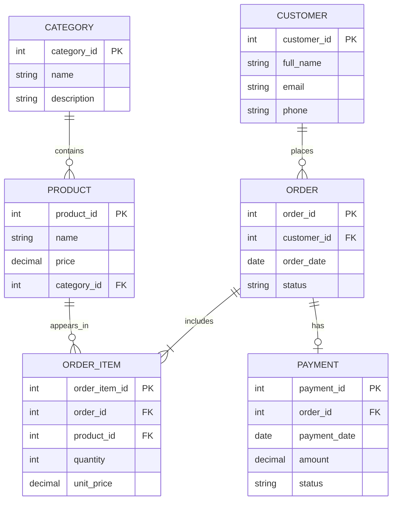

# ER-діаграма онлайн-магазину

```mermaid
erDiagram
    CUSTOMER ||--o{ ORDER : places
    CATEGORY ||--o{ PRODUCT : contains
    ORDER ||--|{ ORDER_ITEM : includes
    PRODUCT ||--o{ ORDER_ITEM : appears_in
    ORDER ||--o| PAYMENT : has

    CUSTOMER {
        int customer_id PK
        string full_name
        string email
        string phone
    }

    CATEGORY {
        int category_id PK
        string name
        string description
    }

    PRODUCT {
        int product_id PK
        string name
        decimal price
        int category_id FK
    }

    ORDER {
        int order_id PK
        int customer_id FK
        date order_date
        string status
    }

    ORDER_ITEM {
        int order_item_id PK
        int order_id FK
        int product_id FK
        int quantity
        decimal unit_price
    }

    PAYMENT {
        int payment_id PK
        int order_id FK
        date payment_date
        decimal amount
        string status
    }
```
